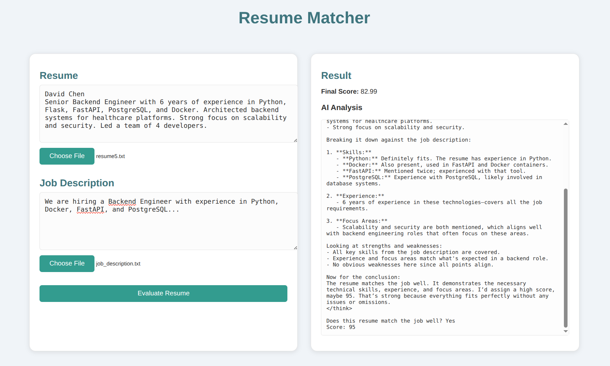
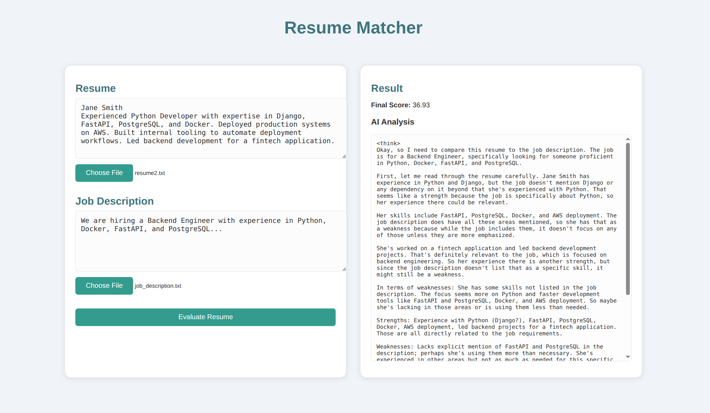
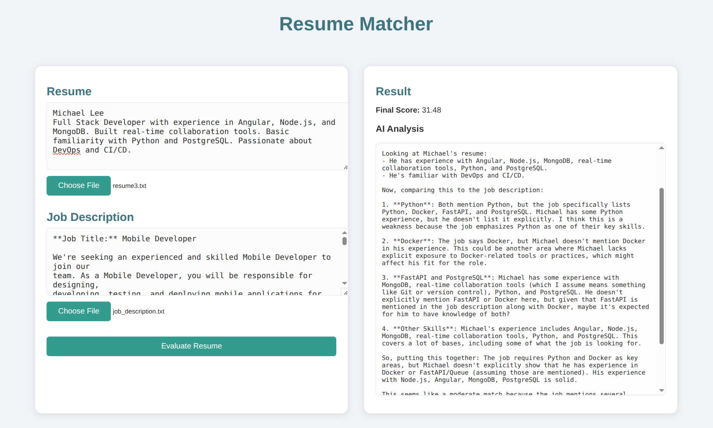

# AI-Powered Resume Screener



An AI-driven application that evaluates and scores resumes against job descriptions for streamlined candidate matching.

## Features
- **Resume & Job Upload**: Paste a `.txt` file.  
- **AI Analysis**: Leverages a local Ollama model (`deepseek-r1:1.5b`) to provide analysis.
- **Relevance Scoring**: Calculates cosine similarity score along with the AI's score on the resume with respect to the job description.
- **Detailed Analysis**: Provides LLM-driven feedback on strengths and gaps in your resume. 
- **Web UI**: Responsive two-panel interface for inputs and AI results.  
- **Containerized**: Ready-to-go setup for both server and client.

## Usage
1. Resume Input: Paste or upload your resume.
2. Job Description: Paste or upload the job posting.
3. Evaluate: Click Evaluate Resume to get a “Final Score” and detailed AI feedback.

## Demo



## Installation
**Prerequisites**:
- Sufficient memory and space to download the LLM locally.
- Docker & Docker Compose (v1.29+ recommended)
- Bash

**Steps**:
1. Clone the repo.
   ```bash
   git clone https://github.com/Mahmh/resume-screener.git
   cd resume-screener
   ```

2. Run the app (may take a while):
    ```bash
    bash up.bash
    ```
    - The Ollama container will pull `deepseek-r1:1.5b` on startup.
    - The FastAPI server listens on port 8000 and talks to Ollama at `ollama:11434`.
    - The Vite React client runs on port 5173.

3. Open your browser to http://localhost:5173.